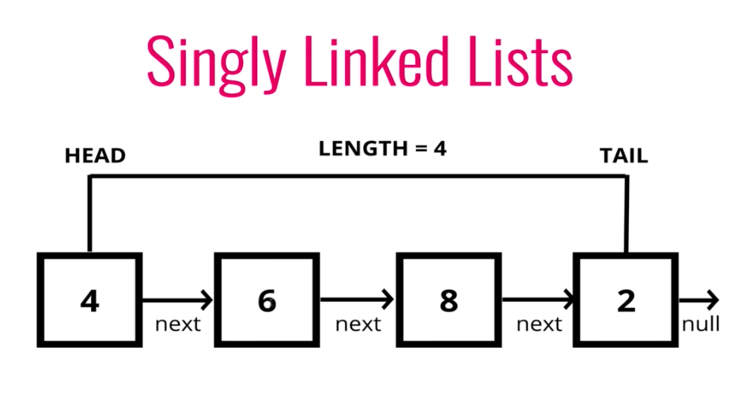

# Data Structure: 

 ## Singly Linked List:

    

    - Will help you to orgnize the data and store the data. 
    - A linked list is a linear data structure where each element is a separate object. Each element of a list is comprising of two items - the data and a reference to the next node. 
    - Linked Lists are incredibly useful programming data structures; they store both data and order information in a dynamic way. 
    - The entry point into a linked list is called the head of the list.
    - The end point into a linked list is called the tail of the list. 
    - There are some methos will help you to organize Singly Linked List:
    1. Push -> Takes value in. (adding node to end of the list)
    2. Pop (removing node from end of the list)
    3. Shift (removing node from beginning)
    4. Unshift -> Takes value in. (adding node to beginning)
    5. Get (getting node from the list)
    6. Set (setting node to something else)
    7. Insert -> Takes index and value (insert value at any index)
    8. Remove -> takes index in. (remove any data from that index)

## Stacks: 

    

    - Stack is a linear data structure in which additionand removal follows in a particular order;
    - LIFO => Last In First Out
    - Assuming the stack can grow dynamically, we are not considering the overflow condition. 
    - There will be 2 main methods to make stacks to work. 
    1. Push -> Takes value in. (adding element to the end of the stack)
    2. Pop (removing element from the stack, if the function is call onthe empty stack its indicates "underflow")
        - this mwthod returns the top most element of the stack bcz of LIFO.
    

