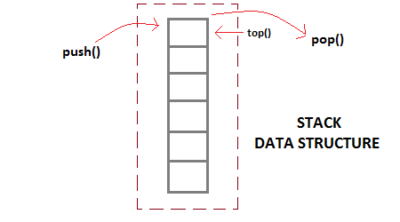
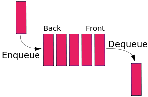
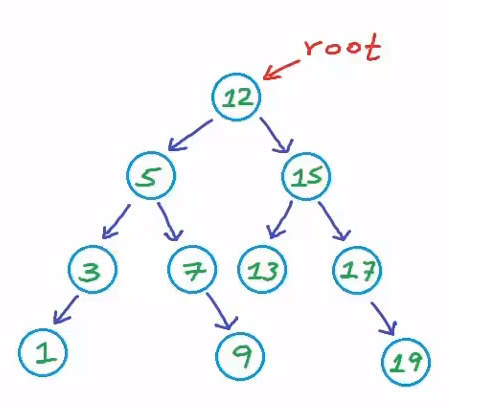

# Data Structure: 

 ## Singly Linked List:
  
  
  - Will help you to orgnize the data and store the data. 
  - A linked list is a linear data structure where each element is a separate object. Each element of a list is comprising of two items - the data and a reference to the next node. 
  - Linked Lists are incredibly useful programming data structures; they store both data and order information in a dynamic way. 
  - The entry point into a linked list is called the head of the list.
  - The end point into a linked list is called the tail of the list. 
  - There are some methos will help you to organize Singly Linked List:
  1. Push -> Takes value in. (adding node to end of the list)
  2. Pop (removing node from end of the list)
  3. Shift (removing node from beginning)
  4. Unshift -> Takes value in. (adding node to beginning)
  5. Get (getting node from the list)
  6. Set (setting node to something else)
  7. Insert -> Takes index and value (insert value at any index)
  8. Remove -> takes index in. (remove any data from that index)

## Stacks: 
  
   
  - Stack is a linear data structure in which additionand removal follows in a particular order;
  - LIFO => Last In First Out
  - Assuming the stack can grow dynamically, we are not considering the overflow condition. 
  - There will be 2 main methods to make stacks to work. 
  1. Push -> Takes value in. (adding element to the end of the stack)
  2. Pop (removing element from the stack, if the function is call onthe empty stack its indicates "underflow")
      - this mwthod returns the top most element of the stack bcz of LIFO.
    
## Queues:
  

  - Queue is a linear data structure in which additional removal follows ina particular order;
  - FIFO => First In First Out
  - Assuming the stack can grow dynamically, we are not considering the overflow condition. 
  - There will be 2 main methods to make queues to work.
  1. Enqueue -> Takes value in. (adding element to the queue using push to end)
  2. Dequeue -> (removing element from the queue using shift to beginnning)

## Binary search tree(BST):
  

  - A Tree is a collection of node connected by some edges. A tree is a non linear data structure. 
  - There are some basic structure of the tree :
    - Root: The top node in a tree
    - Child: A node directly connected to another node when moving away from the root. 
    - Parent: the converse notion of a child.
    - Sibling: A group of nodes with the same parent. 
    - Leaf: A node with no children.
    - Edge: The connection between one node and another. 
  - A Binary Search tree is a tree data structure in which each node has at most two children, which are referred toas left child and right child. 
  - A binary search tree in which nodes which have lesser value stored on the left while the nodes with higher value are stored at hte right. 
  - There will be some method we can build to BST:
    1. insert -> It will takes the value in as argument. It will insert the value where it should go. It will check left or right, depends the value is larger or smaller than the root value. 
    2. Find -> It will takes the value in as argument. It will find the value from appropiate position from the BST. Same way it will go to either way right or left, depends on value. 
    

